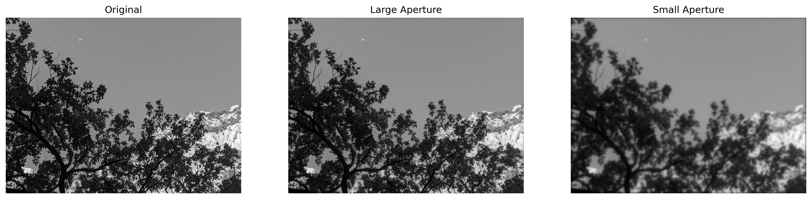
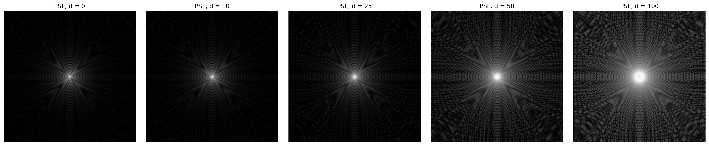
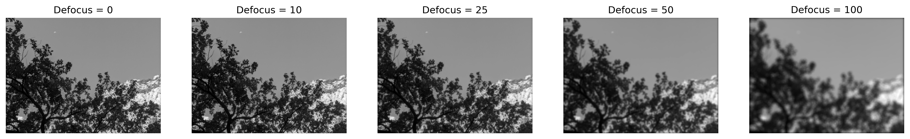
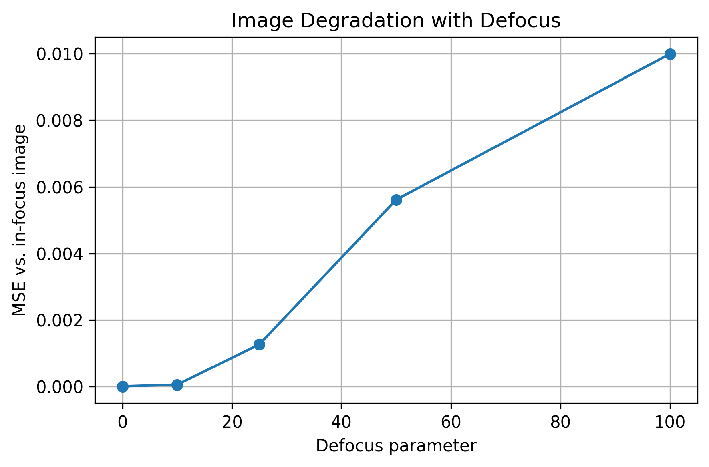

# Camera Optics Lab

A computational imaging project exploring how diffraction, defocus, and optical aberrations affect image formation.

The central workflow is:

**Optical system parameters → PSF → Image formation → Image quality**

## Goal

Build a simple optical imaging model in Python and study how an ideal point source becomes a point spread function (PSF), and how that PSF changes real images.

## Questions

- Why does a point source not remain a perfect point after passing through an optical system?
- How do diffraction and defocus change the PSF?
- How do aberrations degrade image quality?
- Which optical effects matter most for the final image?

## Planned Steps

1. Simulate an ideal diffraction-limited PSF
2. Apply the PSF to a real image using convolution
3. Add defocus
4. Add optical aberrations
5. Compare image degradation quantitatively
6. Explore basic image recovery

## Current Progress

### 01 — Ideal Diffraction-Limited PSF

- Built a circular aperture model
- Computed the diffraction-limited PSF using a 2D Fourier transform
- Visualized the PSF in linear and logarithmic scale
- Applied the PSF to a real grayscale image using convolution
- Compared image blur for two aperture radii: `0.35` and `0.08`
- Observed that the smaller aperture (`radius = 0.08`) produces a broader PSF and stronger diffraction blur than the larger aperture (`radius = 0.35`)

The aperture radius was varied while defocus was kept at zero, isolating the effect of diffraction.

**Aperture size → Diffraction PSF → Image sharpness**

## Example Result

### 02 — Defocus

- Fixed the aperture radius at `BASE_RADIUS = 0.35`
- Varied the defocus parameter while keeping the aperture constant
- Modeled defocus using a quadratic phase term in the pupil plane
- Computed the corresponding PSF for multiple defocus values
- Applied each PSF to the same input image using convolution
- Observed that stronger defocus produces a broader PSF and more visible image blur
- Quantified image degradation using Mean Squared Error (MSE) relative to the in-focus image

The aperture was kept fixed while only defocus was varied, isolating the effect of focus error.

**Defocus → PSF change → Image degradation**

## Example Result

The original image is the ideal input, while the in-focus image has already passed through the finite-aperture optical system and therefore includes diffraction-limited blur.

## Tools

- Python
- NumPy
- SciPy
- Matplotlib
- Jupyter Notebook

## Status

Work in progress.
