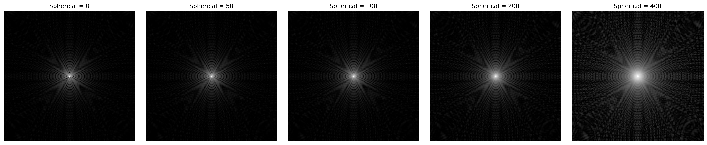
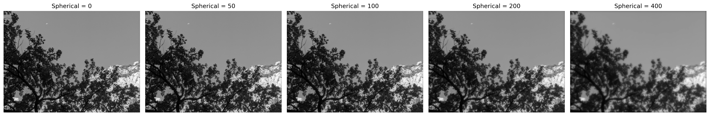
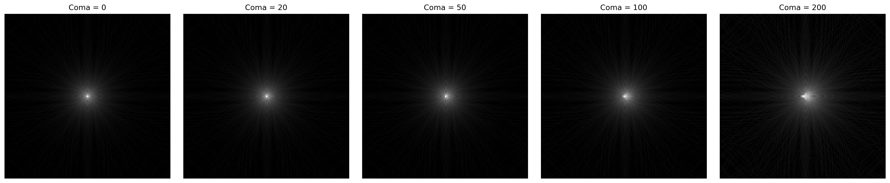
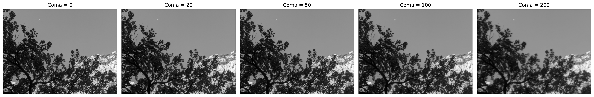
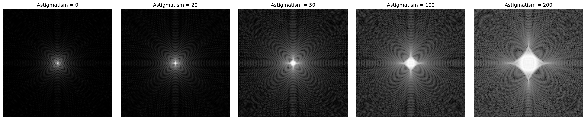
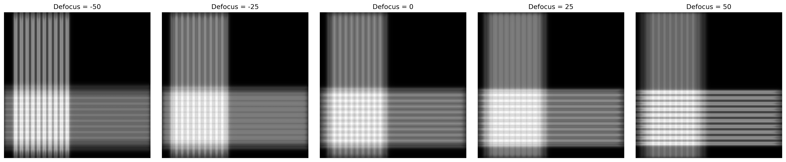

# Camera Optics Lab

A computational imaging project exploring how diffraction, defocus, and optical aberrations affect image formation.

The central workflow is:

**Optical system parameters → PSF → Image formation → Image quality**

## Goal

Build a simple optical imaging model in Python and study how an ideal point source becomes a point spread function (PSF), and how that PSF changes real images.

## Questions

- Why does a point source not remain a perfect point after passing through an optical system?
- How do diffraction and defocus change the PSF?
- How do different optical aberrations produce distinct PSF structures and image artifacts?
- Which optical effects matter most for the final image?

## Planned Steps

1. Simulate an ideal diffraction-limited PSF
2. Apply the PSF to a real image using convolution
3. Add defocus
4. Compare spherical aberration, coma, and astigmatism
5. Compare image degradation quantitatively
6. Explore basic image recovery

## Current Progress

### 01 — Ideal Diffraction-Limited PSF

- Built a circular aperture model
- Computed the diffraction-limited PSF using a 2D Fourier transform
- Visualized the PSF in linear and logarithmic scale
- Applied the PSF to a real grayscale image using convolution
- Compared image blur for two aperture radii: `0.35` and `0.08`
- Observed that the smaller aperture (`radius = 0.08`) produces a broader PSF and stronger diffraction blur than the larger aperture (`radius = 0.35`)

The aperture radius was varied while defocus was kept at zero, isolating the effect of diffraction.

**Aperture size → Diffraction PSF → Image sharpness**

## Example Result

### 02 — Defocus

- Fixed the aperture radius at `BASE_RADIUS = 0.35`
- Varied the defocus parameter while keeping the aperture constant
- Modeled defocus using a quadratic phase term in the pupil plane
- Computed the corresponding PSF for multiple defocus values
- Applied each PSF to the same input image using convolution
- Observed that stronger defocus produces a broader PSF and more visible image blur
- Quantified image degradation using Mean Squared Error (MSE) relative to the in-focus image

The aperture was kept fixed while only defocus was varied, isolating the effect of focus error.

**Defocus → PSF change → Image degradation**

## Example Result

The original image is the ideal input, while the in-focus image has already passed through the finite-aperture optical system and therefore includes diffraction-limited blur.

### 03 — Optical Aberrations

- Kept the baseline aperture fixed at `BASE_RADIUS = 0.35`
- Added spherical aberration, coma, and astigmatism as pupil-plane phase errors
- Compared how different aberrations modify the PSF
- Applied aberrated PSFs to the same input image
- Observed that different aberrations produce distinct image artifacts
- Used a focus sweep to reveal the directional nature of astigmatism

The aperture was kept fixed while the aberration type and strength were varied, allowing the characteristic PSF structures of different optical errors to be compared.

**Optical aberration → PSF structure → Characteristic image degradation**

#### Spherical Aberration

Spherical aberration preserves circular symmetry but gradually redistributes energy away from the central peak.

As the aberration increases, the central PSF becomes less concentrated and the surrounding ring structure becomes more pronounced.

#### Coma

Coma breaks the circular symmetry of the PSF and produces a directional, comet-like structure.

In the image domain, this appears as directional smearing rather than uniform blur.

#### Astigmatism

Astigmatism causes the optical system to behave differently along two orthogonal directions.

Its PSF develops strongly directional structures rather than remaining circularly symmetric.

A focus sweep was used to show the key signature of astigmatism: the two orthogonal directions reach their best focus at different image planes.

## Tools

- Python
- NumPy
- SciPy
- Matplotlib
- Jupyter Notebook

## Status

Work in progress.
